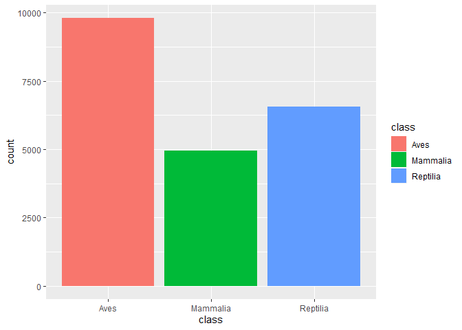
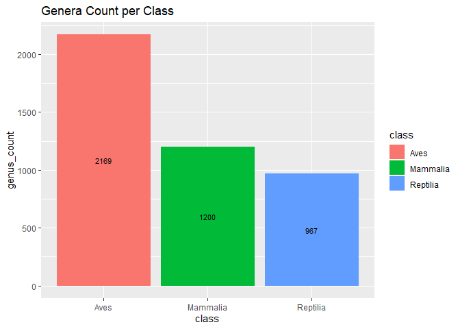
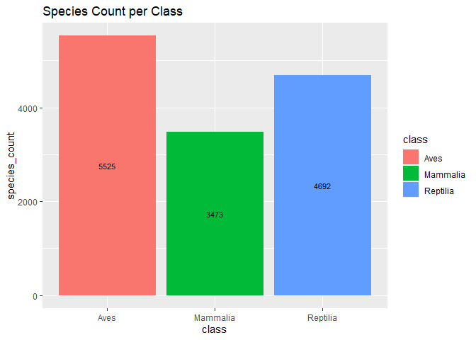
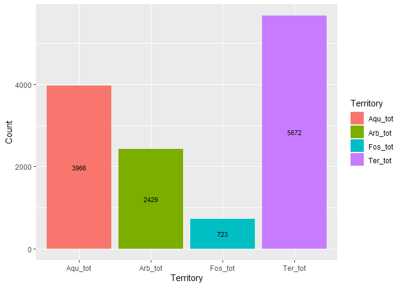
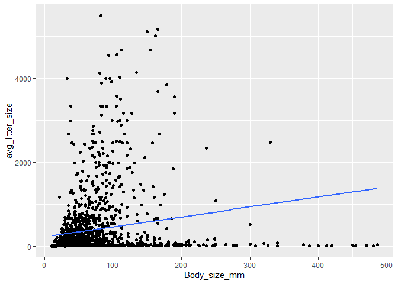
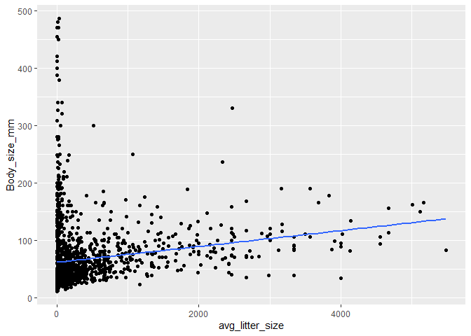

## Libraries

```r
library(tidyverse)
```

```
## -- Attaching packages ------------------------------------------------------------------------------------------------ tidyverse 1.3.0 --
```

```
## v ggplot2 3.2.1     v purrr   0.3.3
## v tibble  2.1.3     v dplyr   0.8.4
## v tidyr   1.0.2     v stringr 1.4.0
## v readr   1.3.1     v forcats 0.4.0
```

```
## -- Conflicts --------------------------------------------------------------------------------------------------- tidyverse_conflicts() --
## x dplyr::filter() masks stats::filter()
## x dplyr::lag()    masks stats::lag()
```

```r
library(naniar)
library(skimr)
```

```
## 
## Attaching package: 'skimr'
```

```
## The following object is masked from 'package:naniar':
## 
##     n_complete
```


```r
getwd()
```

```
## [1] "C:/Users/savit/OneDrive/Documents/GitHub/BIS15W2020_ssastry/Homeworks"
```

## Data

### `amniota` data
Myhrvold N, Baldridge E, Chan B, Sivam D, Freeman DL, Ernest SKM (2015). “An amniote life-history
database to perform comparative analyses with birds, mammals, and reptiles.” _Ecology_, *96*, 3109.
doi: 10.1890/15-0846.1 (URL: https://doi.org/10.1890/15-0846.1).

```r
amniota <- 
  readr::read_csv("C:/Users/savit/OneDrive/Documents/GitHub/BIS15W2020_ssastry/lab5/data/amniota.csv")
```

```
## Parsed with column specification:
## cols(
##   .default = col_double(),
##   class = col_character(),
##   order = col_character(),
##   family = col_character(),
##   genus = col_character(),
##   species = col_character(),
##   common_name = col_character()
## )
```

```
## See spec(...) for full column specifications.
```

### `amphibio` data
Oliveira BF, São-Pedro VA, Santos-Barrera G, Penone C, Costa GC (2017). “AmphiBIO, a global database
for amphibian ecological traits.” _Scientific Data_, *4*, 170123. doi: 10.1038/sdata.2017.123 (URL:
https://doi.org/10.1038/sdata.2017.123).

```r
amphibio <- 
  readr::read_csv("C:/Users/savit/OneDrive/Documents/GitHub/BIS15W2020_ssastry/lab5/data/amphibio.csv")
```

```
## Parsed with column specification:
## cols(
##   .default = col_double(),
##   id = col_character(),
##   Order = col_character(),
##   Family = col_character(),
##   Genus = col_character(),
##   Species = col_character(),
##   Seeds = col_logical(),
##   OBS = col_logical()
## )
```

```
## See spec(...) for full column specifications.
```

```
## Warning: 125 parsing failures.
##  row col           expected                                                           actual                                                                                 file
## 1410 OBS 1/0/T/F/TRUE/FALSE Identified as P. appendiculata in Boquimpani-Freitas et al. 2002 'C:/Users/savit/OneDrive/Documents/GitHub/BIS15W2020_ssastry/lab5/data/amphibio.csv'
## 1416 OBS 1/0/T/F/TRUE/FALSE Identified as T. miliaris in Giaretta and Facure 2004            'C:/Users/savit/OneDrive/Documents/GitHub/BIS15W2020_ssastry/lab5/data/amphibio.csv'
## 1447 OBS 1/0/T/F/TRUE/FALSE Considered endangered by Soto-Azat et al. 2013                   'C:/Users/savit/OneDrive/Documents/GitHub/BIS15W2020_ssastry/lab5/data/amphibio.csv'
## 1448 OBS 1/0/T/F/TRUE/FALSE Considered extinct by Soto-Azat et al. 2013                      'C:/Users/savit/OneDrive/Documents/GitHub/BIS15W2020_ssastry/lab5/data/amphibio.csv'
## 1471 OBS 1/0/T/F/TRUE/FALSE nomem dubitum                                                    'C:/Users/savit/OneDrive/Documents/GitHub/BIS15W2020_ssastry/lab5/data/amphibio.csv'
## .... ... .................. ................................................................ ....................................................................................
## See problems(...) for more details.
```

1. First, do some exploratory analysis of both data sets. What is the structure, column names, and dimensions?


```r
colnames(amniota)
```

```
##  [1] "class"                                
##  [2] "order"                                
##  [3] "family"                               
##  [4] "genus"                                
##  [5] "species"                              
##  [6] "subspecies"                           
##  [7] "common_name"                          
##  [8] "female_maturity_d"                    
##  [9] "litter_or_clutch_size_n"              
## [10] "litters_or_clutches_per_y"            
## [11] "adult_body_mass_g"                    
## [12] "maximum_longevity_y"                  
## [13] "gestation_d"                          
## [14] "weaning_d"                            
## [15] "birth_or_hatching_weight_g"           
## [16] "weaning_weight_g"                     
## [17] "egg_mass_g"                           
## [18] "incubation_d"                         
## [19] "fledging_age_d"                       
## [20] "longevity_y"                          
## [21] "male_maturity_d"                      
## [22] "inter_litter_or_interbirth_interval_y"
## [23] "female_body_mass_g"                   
## [24] "male_body_mass_g"                     
## [25] "no_sex_body_mass_g"                   
## [26] "egg_width_mm"                         
## [27] "egg_length_mm"                        
## [28] "fledging_mass_g"                      
## [29] "adult_svl_cm"                         
## [30] "male_svl_cm"                          
## [31] "female_svl_cm"                        
## [32] "birth_or_hatching_svl_cm"             
## [33] "female_svl_at_maturity_cm"            
## [34] "female_body_mass_at_maturity_g"       
## [35] "no_sex_svl_cm"                        
## [36] "no_sex_maturity_d"
```


```r
str(amniota)
```

```
## Classes 'spec_tbl_df', 'tbl_df', 'tbl' and 'data.frame':	21322 obs. of  36 variables:
##  $ class                                : chr  "Aves" "Aves" "Aves" "Aves" ...
##  $ order                                : chr  "Accipitriformes" "Accipitriformes" "Accipitriformes" "Accipitriformes" ...
##  $ family                               : chr  "Accipitridae" "Accipitridae" "Accipitridae" "Accipitridae" ...
##  $ genus                                : chr  "Accipiter" "Accipiter" "Accipiter" "Accipiter" ...
##  $ species                              : chr  "albogularis" "badius" "bicolor" "brachyurus" ...
##  $ subspecies                           : num  -999 -999 -999 -999 -999 -999 -999 -999 -999 -999 ...
##  $ common_name                          : chr  "Pied Goshawk" "Shikra" "Bicolored Hawk" "New Britain Sparrowhawk" ...
##  $ female_maturity_d                    : num  -999 363 -999 -999 363 ...
##  $ litter_or_clutch_size_n              : num  -999 3.25 2.7 -999 4 -999 2.7 4.25 3.25 4.35 ...
##  $ litters_or_clutches_per_y            : num  -999 1 -999 -999 1 -999 -999 1 -999 1 ...
##  $ adult_body_mass_g                    : num  252 140 345 142 204 ...
##  $ maximum_longevity_y                  : num  -999 -999 -999 -999 -999 ...
##  $ gestation_d                          : num  -999 -999 -999 -999 -999 -999 -999 -999 -999 -999 ...
##  $ weaning_d                            : num  -999 -999 -999 -999 -999 -999 -999 -999 -999 -999 ...
##  $ birth_or_hatching_weight_g           : num  -999 -999 -999 -999 -999 -999 -999 -999 -999 28 ...
##  $ weaning_weight_g                     : num  -999 -999 -999 -999 -999 -999 -999 -999 -999 -999 ...
##  $ egg_mass_g                           : num  -999 21 32 -999 21.9 ...
##  $ incubation_d                         : num  -999 30 -999 -999 32.5 ...
##  $ fledging_age_d                       : num  -999 32 -999 -999 42.5 ...
##  $ longevity_y                          : num  -999 -999 -999 -999 -999 ...
##  $ male_maturity_d                      : num  -999 -999 -999 -999 -999 -999 -999 365 -999 730 ...
##  $ inter_litter_or_interbirth_interval_y: num  -999 -999 -999 -999 -999 -999 -999 -999 -999 -999 ...
##  $ female_body_mass_g                   : num  352 168 390 -999 230 ...
##  $ male_body_mass_g                     : num  223 125 212 142 170 ...
##  $ no_sex_body_mass_g                   : num  -999 123 -999 -999 -999 ...
##  $ egg_width_mm                         : num  -999 -999 -999 -999 -999 -999 -999 -999 -999 -999 ...
##  $ egg_length_mm                        : num  -999 -999 -999 -999 -999 -999 -999 -999 -999 -999 ...
##  $ fledging_mass_g                      : num  -999 -999 -999 -999 -999 -999 -999 -999 -999 -999 ...
##  $ adult_svl_cm                         : num  -999 30 39.5 -999 33.5 -999 39.5 29 32.5 42 ...
##  $ male_svl_cm                          : num  -999 -999 -999 -999 -999 -999 -999 -999 -999 -999 ...
##  $ female_svl_cm                        : num  -999 -999 -999 -999 -999 -999 -999 -999 -999 -999 ...
##  $ birth_or_hatching_svl_cm             : num  -999 -999 -999 -999 -999 -999 -999 -999 -999 -999 ...
##  $ female_svl_at_maturity_cm            : num  -999 -999 -999 -999 -999 -999 -999 -999 -999 -999 ...
##  $ female_body_mass_at_maturity_g       : num  -999 -999 -999 -999 -999 -999 -999 -999 -999 -999 ...
##  $ no_sex_svl_cm                        : num  -999 -999 -999 -999 -999 -999 -999 -999 -999 -999 ...
##  $ no_sex_maturity_d                    : num  -999 -999 -999 -999 -999 -999 -999 -999 -999 -999 ...
##  - attr(*, "spec")=
##   .. cols(
##   ..   class = col_character(),
##   ..   order = col_character(),
##   ..   family = col_character(),
##   ..   genus = col_character(),
##   ..   species = col_character(),
##   ..   subspecies = col_double(),
##   ..   common_name = col_character(),
##   ..   female_maturity_d = col_double(),
##   ..   litter_or_clutch_size_n = col_double(),
##   ..   litters_or_clutches_per_y = col_double(),
##   ..   adult_body_mass_g = col_double(),
##   ..   maximum_longevity_y = col_double(),
##   ..   gestation_d = col_double(),
##   ..   weaning_d = col_double(),
##   ..   birth_or_hatching_weight_g = col_double(),
##   ..   weaning_weight_g = col_double(),
##   ..   egg_mass_g = col_double(),
##   ..   incubation_d = col_double(),
##   ..   fledging_age_d = col_double(),
##   ..   longevity_y = col_double(),
##   ..   male_maturity_d = col_double(),
##   ..   inter_litter_or_interbirth_interval_y = col_double(),
##   ..   female_body_mass_g = col_double(),
##   ..   male_body_mass_g = col_double(),
##   ..   no_sex_body_mass_g = col_double(),
##   ..   egg_width_mm = col_double(),
##   ..   egg_length_mm = col_double(),
##   ..   fledging_mass_g = col_double(),
##   ..   adult_svl_cm = col_double(),
##   ..   male_svl_cm = col_double(),
##   ..   female_svl_cm = col_double(),
##   ..   birth_or_hatching_svl_cm = col_double(),
##   ..   female_svl_at_maturity_cm = col_double(),
##   ..   female_body_mass_at_maturity_g = col_double(),
##   ..   no_sex_svl_cm = col_double(),
##   ..   no_sex_maturity_d = col_double()
##   .. )
```


```r
dim(amniota)
```

```
## [1] 21322    36
```


```r
colnames(amphibio)
```

```
##  [1] "id"                      "Order"                  
##  [3] "Family"                  "Genus"                  
##  [5] "Species"                 "Fos"                    
##  [7] "Ter"                     "Aqu"                    
##  [9] "Arb"                     "Leaves"                 
## [11] "Flowers"                 "Seeds"                  
## [13] "Fruits"                  "Arthro"                 
## [15] "Vert"                    "Diu"                    
## [17] "Noc"                     "Crepu"                  
## [19] "Wet_warm"                "Wet_cold"               
## [21] "Dry_warm"                "Dry_cold"               
## [23] "Body_mass_g"             "Age_at_maturity_min_y"  
## [25] "Age_at_maturity_max_y"   "Body_size_mm"           
## [27] "Size_at_maturity_min_mm" "Size_at_maturity_max_mm"
## [29] "Longevity_max_y"         "Litter_size_min_n"      
## [31] "Litter_size_max_n"       "Reproductive_output_y"  
## [33] "Offspring_size_min_mm"   "Offspring_size_max_mm"  
## [35] "Dir"                     "Lar"                    
## [37] "Viv"                     "OBS"
```


```r
str(amphibio)
```

```
## Classes 'spec_tbl_df', 'tbl_df', 'tbl' and 'data.frame':	6776 obs. of  38 variables:
##  $ id                     : chr  "Anf0001" "Anf0002" "Anf0003" "Anf0004" ...
##  $ Order                  : chr  "Anura" "Anura" "Anura" "Anura" ...
##  $ Family                 : chr  "Allophrynidae" "Alytidae" "Alytidae" "Alytidae" ...
##  $ Genus                  : chr  "Allophryne" "Alytes" "Alytes" "Alytes" ...
##  $ Species                : chr  "Allophryne ruthveni" "Alytes cisternasii" "Alytes dickhilleni" "Alytes maurus" ...
##  $ Fos                    : num  NA NA NA NA NA 1 1 1 1 1 ...
##  $ Ter                    : num  1 1 1 1 1 1 1 1 1 1 ...
##  $ Aqu                    : num  1 1 1 1 NA 1 1 1 1 1 ...
##  $ Arb                    : num  1 1 1 1 1 1 NA NA NA NA ...
##  $ Leaves                 : num  NA NA NA NA NA NA NA NA NA NA ...
##  $ Flowers                : num  NA NA NA NA NA NA NA NA NA NA ...
##  $ Seeds                  : logi  NA NA NA NA NA NA ...
##  $ Fruits                 : num  NA NA NA NA NA NA NA NA NA NA ...
##  $ Arthro                 : num  1 1 1 NA 1 1 1 1 1 NA ...
##  $ Vert                   : num  NA NA NA NA NA NA 1 NA NA NA ...
##  $ Diu                    : num  1 NA NA NA NA NA 1 1 1 NA ...
##  $ Noc                    : num  1 1 1 NA 1 1 1 1 1 NA ...
##  $ Crepu                  : num  1 NA NA NA NA 1 NA NA NA NA ...
##  $ Wet_warm               : num  NA NA NA NA 1 1 NA NA NA NA ...
##  $ Wet_cold               : num  1 NA NA NA NA NA 1 NA NA NA ...
##  $ Dry_warm               : num  NA NA NA NA NA NA NA NA NA NA ...
##  $ Dry_cold               : num  NA NA NA NA NA NA NA NA NA NA ...
##  $ Body_mass_g            : num  31 6.1 NA NA 2.31 13.4 21.8 NA NA NA ...
##  $ Age_at_maturity_min_y  : num  NA 2 2 NA 3 2 3 NA NA NA ...
##  $ Age_at_maturity_max_y  : num  NA 2 2 NA 3 3 5 NA NA NA ...
##  $ Body_size_mm           : num  31 50 55 NA 40 55 80 60 65 NA ...
##  $ Size_at_maturity_min_mm: num  NA 27 NA NA NA 35 NA NA NA NA ...
##  $ Size_at_maturity_max_mm: num  NA 36 NA NA NA 40.5 NA NA NA NA ...
##  $ Longevity_max_y        : num  NA 6 NA NA NA 7 9 NA NA NA ...
##  $ Litter_size_min_n      : num  300 60 40 NA 7 53 300 1500 1000 NA ...
##  $ Litter_size_max_n      : num  300 180 40 NA 20 171 1500 1500 1000 NA ...
##  $ Reproductive_output_y  : num  1 4 1 4 1 4 6 1 1 1 ...
##  $ Offspring_size_min_mm  : num  NA 2.6 NA NA 5.4 2.6 1.5 NA 1.5 NA ...
##  $ Offspring_size_max_mm  : num  NA 3.5 NA NA 7 5 2 NA 1.5 NA ...
##  $ Dir                    : num  0 0 0 0 0 0 0 0 0 0 ...
##  $ Lar                    : num  1 1 1 1 1 1 1 1 1 1 ...
##  $ Viv                    : num  0 0 0 0 0 0 0 0 0 0 ...
##  $ OBS                    : logi  NA NA NA NA NA NA ...
##  - attr(*, "problems")=Classes 'tbl_df', 'tbl' and 'data.frame':	125 obs. of  5 variables:
##   ..$ row     : int  1410 1416 1447 1448 1471 1488 1539 1540 1543 1544 ...
##   ..$ col     : chr  "OBS" "OBS" "OBS" "OBS" ...
##   ..$ expected: chr  "1/0/T/F/TRUE/FALSE" "1/0/T/F/TRUE/FALSE" "1/0/T/F/TRUE/FALSE" "1/0/T/F/TRUE/FALSE" ...
##   ..$ actual  : chr  "Identified as P. appendiculata in Boquimpani-Freitas et al. 2002" "Identified as T. miliaris in Giaretta and Facure 2004" "Considered endangered by Soto-Azat et al. 2013" "Considered extinct by Soto-Azat et al. 2013" ...
##   ..$ file    : chr  "'C:/Users/savit/OneDrive/Documents/GitHub/BIS15W2020_ssastry/lab5/data/amphibio.csv'" "'C:/Users/savit/OneDrive/Documents/GitHub/BIS15W2020_ssastry/lab5/data/amphibio.csv'" "'C:/Users/savit/OneDrive/Documents/GitHub/BIS15W2020_ssastry/lab5/data/amphibio.csv'" "'C:/Users/savit/OneDrive/Documents/GitHub/BIS15W2020_ssastry/lab5/data/amphibio.csv'" ...
##  - attr(*, "spec")=
##   .. cols(
##   ..   id = col_character(),
##   ..   Order = col_character(),
##   ..   Family = col_character(),
##   ..   Genus = col_character(),
##   ..   Species = col_character(),
##   ..   Fos = col_double(),
##   ..   Ter = col_double(),
##   ..   Aqu = col_double(),
##   ..   Arb = col_double(),
##   ..   Leaves = col_double(),
##   ..   Flowers = col_double(),
##   ..   Seeds = col_logical(),
##   ..   Fruits = col_double(),
##   ..   Arthro = col_double(),
##   ..   Vert = col_double(),
##   ..   Diu = col_double(),
##   ..   Noc = col_double(),
##   ..   Crepu = col_double(),
##   ..   Wet_warm = col_double(),
##   ..   Wet_cold = col_double(),
##   ..   Dry_warm = col_double(),
##   ..   Dry_cold = col_double(),
##   ..   Body_mass_g = col_double(),
##   ..   Age_at_maturity_min_y = col_double(),
##   ..   Age_at_maturity_max_y = col_double(),
##   ..   Body_size_mm = col_double(),
##   ..   Size_at_maturity_min_mm = col_double(),
##   ..   Size_at_maturity_max_mm = col_double(),
##   ..   Longevity_max_y = col_double(),
##   ..   Litter_size_min_n = col_double(),
##   ..   Litter_size_max_n = col_double(),
##   ..   Reproductive_output_y = col_double(),
##   ..   Offspring_size_min_mm = col_double(),
##   ..   Offspring_size_max_mm = col_double(),
##   ..   Dir = col_double(),
##   ..   Lar = col_double(),
##   ..   Viv = col_double(),
##   ..   OBS = col_logical()
##   .. )
```


```r
dim(amphibio)
```

```
## [1] 6776   38
```


```r
amphibio
```

```
## # A tibble: 6,776 x 38
##    id    Order Family Genus Species   Fos   Ter   Aqu   Arb Leaves Flowers Seeds
##    <chr> <chr> <chr>  <chr> <chr>   <dbl> <dbl> <dbl> <dbl>  <dbl>   <dbl> <lgl>
##  1 Anf0~ Anura Allop~ Allo~ Alloph~    NA     1     1     1     NA      NA NA   
##  2 Anf0~ Anura Alyti~ Alyt~ Alytes~    NA     1     1     1     NA      NA NA   
##  3 Anf0~ Anura Alyti~ Alyt~ Alytes~    NA     1     1     1     NA      NA NA   
##  4 Anf0~ Anura Alyti~ Alyt~ Alytes~    NA     1     1     1     NA      NA NA   
##  5 Anf0~ Anura Alyti~ Alyt~ Alytes~    NA     1    NA     1     NA      NA NA   
##  6 Anf0~ Anura Alyti~ Alyt~ Alytes~     1     1     1     1     NA      NA NA   
##  7 Anf0~ Anura Alyti~ Disc~ Discog~     1     1     1    NA     NA      NA NA   
##  8 Anf0~ Anura Alyti~ Disc~ Discog~     1     1     1    NA     NA      NA NA   
##  9 Anf0~ Anura Alyti~ Disc~ Discog~     1     1     1    NA     NA      NA NA   
## 10 Anf0~ Anura Alyti~ Disc~ Discog~     1     1     1    NA     NA      NA NA   
## # ... with 6,766 more rows, and 26 more variables: Fruits <dbl>, Arthro <dbl>,
## #   Vert <dbl>, Diu <dbl>, Noc <dbl>, Crepu <dbl>, Wet_warm <dbl>,
## #   Wet_cold <dbl>, Dry_warm <dbl>, Dry_cold <dbl>, Body_mass_g <dbl>,
## #   Age_at_maturity_min_y <dbl>, Age_at_maturity_max_y <dbl>,
## #   Body_size_mm <dbl>, Size_at_maturity_min_mm <dbl>,
## #   Size_at_maturity_max_mm <dbl>, Longevity_max_y <dbl>,
## #   Litter_size_min_n <dbl>, Litter_size_max_n <dbl>,
## #   Reproductive_output_y <dbl>, Offspring_size_min_mm <dbl>,
## #   Offspring_size_max_mm <dbl>, Dir <dbl>, Lar <dbl>, Viv <dbl>, OBS <lgl>
```


```r
amniota
```

```
## # A tibble: 21,322 x 36
##    class order family genus species subspecies common_name female_maturity~
##    <chr> <chr> <chr>  <chr> <chr>        <dbl> <chr>                  <dbl>
##  1 Aves  Acci~ Accip~ Acci~ albogu~       -999 Pied Gosha~            -999 
##  2 Aves  Acci~ Accip~ Acci~ badius        -999 Shikra                  363.
##  3 Aves  Acci~ Accip~ Acci~ bicolor       -999 Bicolored ~            -999 
##  4 Aves  Acci~ Accip~ Acci~ brachy~       -999 New Britai~            -999 
##  5 Aves  Acci~ Accip~ Acci~ brevip~       -999 Levant Spa~             363.
##  6 Aves  Acci~ Accip~ Acci~ castan~       -999 Chestnut-f~            -999 
##  7 Aves  Acci~ Accip~ Acci~ chilen~       -999 Chilean Ha~            -999 
##  8 Aves  Acci~ Accip~ Acci~ chiono~       -999 White-brea~             548.
##  9 Aves  Acci~ Accip~ Acci~ cirroc~       -999 Collared S~            -999 
## 10 Aves  Acci~ Accip~ Acci~ cooper~       -999 Cooper's H~             730 
## # ... with 21,312 more rows, and 28 more variables:
## #   litter_or_clutch_size_n <dbl>, litters_or_clutches_per_y <dbl>,
## #   adult_body_mass_g <dbl>, maximum_longevity_y <dbl>, gestation_d <dbl>,
## #   weaning_d <dbl>, birth_or_hatching_weight_g <dbl>, weaning_weight_g <dbl>,
## #   egg_mass_g <dbl>, incubation_d <dbl>, fledging_age_d <dbl>,
## #   longevity_y <dbl>, male_maturity_d <dbl>,
## #   inter_litter_or_interbirth_interval_y <dbl>, female_body_mass_g <dbl>,
## #   male_body_mass_g <dbl>, no_sex_body_mass_g <dbl>, egg_width_mm <dbl>,
## #   egg_length_mm <dbl>, fledging_mass_g <dbl>, adult_svl_cm <dbl>,
## #   male_svl_cm <dbl>, female_svl_cm <dbl>, birth_or_hatching_svl_cm <dbl>,
## #   female_svl_at_maturity_cm <dbl>, female_body_mass_at_maturity_g <dbl>,
## #   no_sex_svl_cm <dbl>, no_sex_maturity_d <dbl>
```

2. How many total NAs are in each data set? Do these values make sense? Are NAs represented by any other values?


```r
amniota %>%
  summarize(na_count = sum(is.na(amniota)))
```

```
## # A tibble: 1 x 1
##   na_count
##      <int>
## 1        0
```

```r
#It can't be true that the 'amniota' data set has 0 na values. Looking at the data, it seems there is a lot of '-999' values, which may be considered na according to those who compiled this data set. 
```


```r
amphibio %>%
  summarize(na_count = sum(is.na(amphibio)))
```

```
## # A tibble: 1 x 1
##   na_count
##      <int>
## 1   170691
```

3. Make any necessary replacements in the data such that all NAs appear as "NA".


```r
amniota <- amniota %>%
  na_if("-999")

amniota
```

```
## # A tibble: 21,322 x 36
##    class order family genus species subspecies common_name female_maturity~
##    <chr> <chr> <chr>  <chr> <chr>        <dbl> <chr>                  <dbl>
##  1 Aves  Acci~ Accip~ Acci~ albogu~         NA Pied Gosha~              NA 
##  2 Aves  Acci~ Accip~ Acci~ badius          NA Shikra                  363.
##  3 Aves  Acci~ Accip~ Acci~ bicolor         NA Bicolored ~              NA 
##  4 Aves  Acci~ Accip~ Acci~ brachy~         NA New Britai~              NA 
##  5 Aves  Acci~ Accip~ Acci~ brevip~         NA Levant Spa~             363.
##  6 Aves  Acci~ Accip~ Acci~ castan~         NA Chestnut-f~              NA 
##  7 Aves  Acci~ Accip~ Acci~ chilen~         NA Chilean Ha~              NA 
##  8 Aves  Acci~ Accip~ Acci~ chiono~         NA White-brea~             548.
##  9 Aves  Acci~ Accip~ Acci~ cirroc~         NA Collared S~              NA 
## 10 Aves  Acci~ Accip~ Acci~ cooper~         NA Cooper's H~             730 
## # ... with 21,312 more rows, and 28 more variables:
## #   litter_or_clutch_size_n <dbl>, litters_or_clutches_per_y <dbl>,
## #   adult_body_mass_g <dbl>, maximum_longevity_y <dbl>, gestation_d <dbl>,
## #   weaning_d <dbl>, birth_or_hatching_weight_g <dbl>, weaning_weight_g <dbl>,
## #   egg_mass_g <dbl>, incubation_d <dbl>, fledging_age_d <dbl>,
## #   longevity_y <dbl>, male_maturity_d <dbl>,
## #   inter_litter_or_interbirth_interval_y <dbl>, female_body_mass_g <dbl>,
## #   male_body_mass_g <dbl>, no_sex_body_mass_g <dbl>, egg_width_mm <dbl>,
## #   egg_length_mm <dbl>, fledging_mass_g <dbl>, adult_svl_cm <dbl>,
## #   male_svl_cm <dbl>, female_svl_cm <dbl>, birth_or_hatching_svl_cm <dbl>,
## #   female_svl_at_maturity_cm <dbl>, female_body_mass_at_maturity_g <dbl>,
## #   no_sex_svl_cm <dbl>, no_sex_maturity_d <dbl>
```

4. Use the package `naniar` to produce a summary, including percentages, of missing data in each column for both data sets.


```r
naniar::miss_var_summary(amniota)
```

```
## # A tibble: 36 x 3
##    variable                       n_miss pct_miss
##    <chr>                           <int>    <dbl>
##  1 subspecies                      21322    100  
##  2 female_body_mass_at_maturity_g  21318    100. 
##  3 female_svl_at_maturity_cm       21120     99.1
##  4 fledging_mass_g                 21111     99.0
##  5 male_svl_cm                     21040     98.7
##  6 no_sex_maturity_d               20860     97.8
##  7 egg_width_mm                    20727     97.2
##  8 egg_length_mm                   20702     97.1
##  9 weaning_weight_g                20258     95.0
## 10 female_svl_cm                   20242     94.9
## # ... with 26 more rows
```

```r
#looks like majority of the variables have a very large percentage of NA values. 
```


```r
naniar::miss_var_summary(amphibio)
```

```
## # A tibble: 38 x 3
##    variable n_miss pct_miss
##    <chr>     <int>    <dbl>
##  1 OBS        6776    100  
##  2 Fruits     6774    100. 
##  3 Flowers    6772     99.9
##  4 Seeds      6772     99.9
##  5 Leaves     6752     99.6
##  6 Dry_cold   6735     99.4
##  7 Vert       6657     98.2
##  8 Wet_cold   6625     97.8
##  9 Crepu      6608     97.5
## 10 Dry_warm   6572     97.0
## # ... with 28 more rows
```

```r
#looks like majority of the variables have a very large percentage of NA values.
```

5. For the `amniota` data, calculate the number of NAs in the `egg_mass_g` column sorted by taxonomic class; i.e. how many NAs are present in the `egg_mass_g` column in birds, mammals, and reptiles? Does this results make sense biologically? How do these results affect your interpretation of NAs?


```r
amniota %>%
  group_by(class) %>%
  select(class, egg_mass_g) %>%
  naniar::miss_var_summary(class = T)
```

```
## Warning: `cols` is now required.
## Please use `cols = c(data)`
```

```
## # A tibble: 3 x 4
## # Groups:   class [3]
##   class    variable   n_miss pct_miss
##   <chr>    <chr>       <int>    <dbl>
## 1 Aves     egg_mass_g   4914     50.1
## 2 Mammalia egg_mass_g   4953    100  
## 3 Reptilia egg_mass_g   6040     92.0
```

```r
#It makes sense that there is 100% NAs in mammalia because they don't lay eggs. It is surprising that almost 92% of the values from this column are missing because most reptiles lay eggs. 

#These results have made me aware that NA values could be present when data was not able to be recorded, not collected at all, or truly not applicable to the measure being studied. However, the value NA itself does not allow us to differentiate between these possibilities. 
```

6. Which taxonomic classes are represented in the data? Summarize this in a chart then make a barplot that shows the proportion of observations in each taxonomic class.


```r
amniota %>%
  ggplot(aes(x = class, fill = class)) +
  geom_bar(stat = "count")
```

<!-- -->

7. Let's explore the taxonomic composition of the data a bit more. How many genera are represented by taxonomic class? Present this as a data table and bar plot.


```r
amniota %>%
  group_by(class) %>%
  summarize(genus_count = length(unique(genus)))
```

```
## # A tibble: 3 x 2
##   class    genus_count
##   <chr>          <int>
## 1 Aves            2169
## 2 Mammalia        1200
## 3 Reptilia         967
```


```r
amniota %>%
  group_by(class) %>%
  summarize(genus_count = length(unique(genus))) %>%
  ggplot(aes(x = class, y = genus_count, fill = class, label = genus_count)) +
  ggtitle("Genera Count per Class") +
  geom_bar(stat = "Identity") +
  geom_text(size = 3, position = position_stack(vjust = 0.5))
```

<!-- -->

8. Lastly, how many species are represented in each taxonomic class? Present this as a data table and bar plot.


```r
amniota %>%
  group_by(class) %>%
  summarize(species_count = length(unique(species)))
```

```
## # A tibble: 3 x 2
##   class    species_count
##   <chr>            <int>
## 1 Aves              5525
## 2 Mammalia          3473
## 3 Reptilia          4692
```


```r
amniota %>%
  group_by(class) %>%
  summarize(species_count = length(unique(species))) %>%
  ggplot(aes(x = class, y = species_count, fill = class, label = species_count)) +
  ggtitle("Species Count per Class") +
  geom_bar(stat = "Identity") +
  geom_text(size = 3, position = position_stack(vjust = 0.5))
```

<!-- -->

9. The `amphibio` data includes information on ecology. Each species is classified as fossorial, terrestrial, aquatic, or arboreal. How many species are in each of these categories? Make a bar plot to visualize these results. Which category is most/ least represented in the data?


```r
amphibio_territory <- amphibio %>%
  summarize(Fos_tot = sum(Fos, na.rm = T),
            Ter_tot = sum(Ter, na.rm = T), 
            Aqu_tot = sum(Aqu, na.rm = T), 
            Arb_tot = sum(Arb, na.rm = T)) %>%
  pivot_longer(`Fos_tot`:`Arb_tot`,
               names_to = "Territory", 
               values_to = "Count",)

amphibio_territory
```

```
## # A tibble: 4 x 2
##   Territory Count
##   <chr>     <dbl>
## 1 Fos_tot     723
## 2 Ter_tot    5672
## 3 Aqu_tot    3966
## 4 Arb_tot    2429
```

```r
#Summarizes the number of species that are in each of fossorial, terrestrial, aquatic, or arboreal categories
```


```r
amphibio_territory %>%
  ggplot(aes(x = Territory, y = Count, fill = Territory, label = Count)) +
  geom_bar(stat = "Identity") +
  geom_text(size = 3, position = position_stack(vjust = 0.5))
```

<!-- -->

```r
#Fossil inhabitants are the least represented adn Terrestrial inhabitants are the most represented
```

10. For the amphibio data, we are interested to know if body size is correlated with litter size? Make a plot that shows this relationship. You should notice that there are outliers. Can you think of a way to identify the outliers for both body size and litter size? What happens when you then re-plot the data?


```r
amphibio
```

```
## # A tibble: 6,776 x 38
##    id    Order Family Genus Species   Fos   Ter   Aqu   Arb Leaves Flowers Seeds
##    <chr> <chr> <chr>  <chr> <chr>   <dbl> <dbl> <dbl> <dbl>  <dbl>   <dbl> <lgl>
##  1 Anf0~ Anura Allop~ Allo~ Alloph~    NA     1     1     1     NA      NA NA   
##  2 Anf0~ Anura Alyti~ Alyt~ Alytes~    NA     1     1     1     NA      NA NA   
##  3 Anf0~ Anura Alyti~ Alyt~ Alytes~    NA     1     1     1     NA      NA NA   
##  4 Anf0~ Anura Alyti~ Alyt~ Alytes~    NA     1     1     1     NA      NA NA   
##  5 Anf0~ Anura Alyti~ Alyt~ Alytes~    NA     1    NA     1     NA      NA NA   
##  6 Anf0~ Anura Alyti~ Alyt~ Alytes~     1     1     1     1     NA      NA NA   
##  7 Anf0~ Anura Alyti~ Disc~ Discog~     1     1     1    NA     NA      NA NA   
##  8 Anf0~ Anura Alyti~ Disc~ Discog~     1     1     1    NA     NA      NA NA   
##  9 Anf0~ Anura Alyti~ Disc~ Discog~     1     1     1    NA     NA      NA NA   
## 10 Anf0~ Anura Alyti~ Disc~ Discog~     1     1     1    NA     NA      NA NA   
## # ... with 6,766 more rows, and 26 more variables: Fruits <dbl>, Arthro <dbl>,
## #   Vert <dbl>, Diu <dbl>, Noc <dbl>, Crepu <dbl>, Wet_warm <dbl>,
## #   Wet_cold <dbl>, Dry_warm <dbl>, Dry_cold <dbl>, Body_mass_g <dbl>,
## #   Age_at_maturity_min_y <dbl>, Age_at_maturity_max_y <dbl>,
## #   Body_size_mm <dbl>, Size_at_maturity_min_mm <dbl>,
## #   Size_at_maturity_max_mm <dbl>, Longevity_max_y <dbl>,
## #   Litter_size_min_n <dbl>, Litter_size_max_n <dbl>,
## #   Reproductive_output_y <dbl>, Offspring_size_min_mm <dbl>,
## #   Offspring_size_max_mm <dbl>, Dir <dbl>, Lar <dbl>, Viv <dbl>, OBS <lgl>
```


```r
#New data frame with body size and average litter size since they only provided min and max litter size values
amphibio_body_litter <- amphibio %>%
  rowwise() %>%
  mutate(avg_litter_size = mean(c(Litter_size_min_n, Litter_size_max_n, na.rm = TRUE))) %>%
  select(Species, Body_size_mm, avg_litter_size)

amphibio_body_litter
```

```
## Source: local data frame [6,776 x 3]
## Groups: <by row>
## 
## # A tibble: 6,776 x 3
##    Species                  Body_size_mm avg_litter_size
##    <chr>                           <dbl>           <dbl>
##  1 Allophryne ruthveni                31          200.  
##  2 Alytes cisternasii                 50           80.3 
##  3 Alytes dickhilleni                 55           27   
##  4 Alytes maurus                      NA           NA   
##  5 Alytes muletensis                  40            9.33
##  6 Alytes obstetricans                55           75   
##  7 Discoglossus galganoi              80          600.  
##  8 Discoglossus jeanneae              60         1000.  
##  9 Discoglossus montalentii           65          667   
## 10 Discoglossus nigriventer           NA           NA   
## # ... with 6,766 more rows
```


```r
amphibio_body_litter %>%
  filter(avg_litter_size <= 5500, Body_size_mm <= 550) %>%
  ggplot(aes(x = Body_size_mm, y = avg_litter_size)) +
  geom_jitter() +
  geom_smooth(method=lm, se=F)
```

<!-- -->


```r
amphibio_body_litter %>%
  filter(avg_litter_size <= 5500, Body_size_mm <= 550) %>%
  ggplot(aes(x = avg_litter_size , y = Body_size_mm)) +
  geom_jitter() + 
  geom_smooth(method=lm, se=F)
```

<!-- -->


