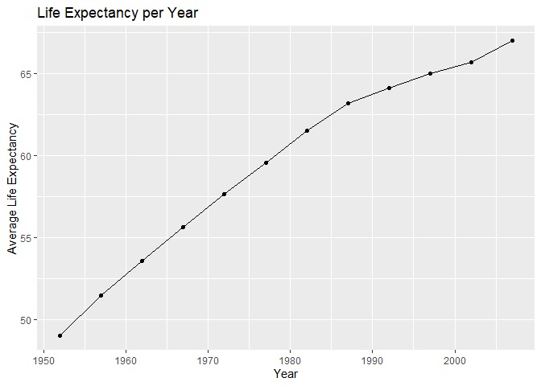
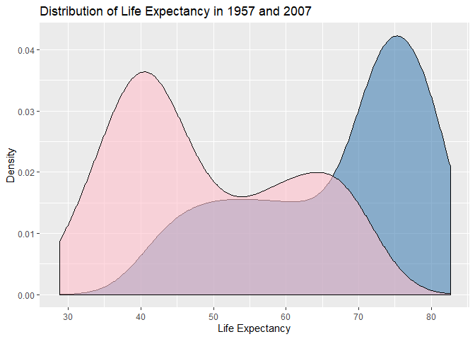
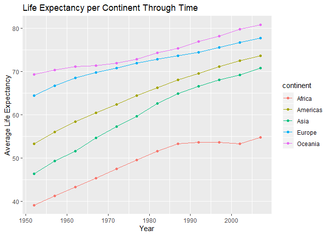
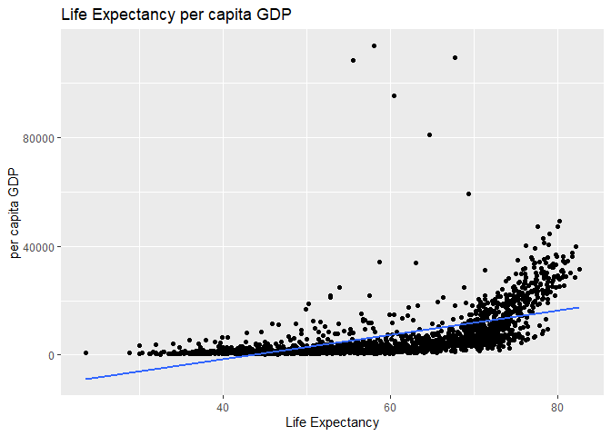
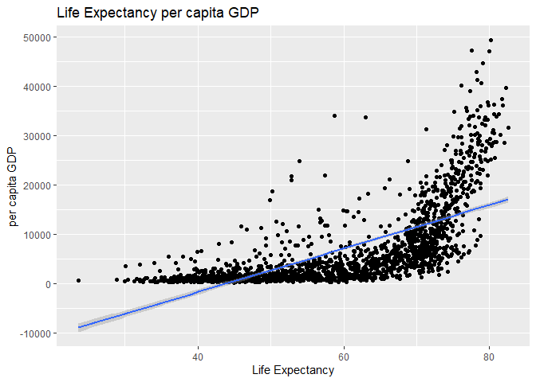
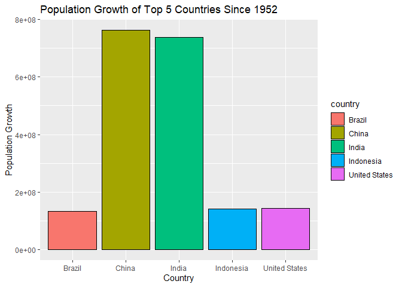
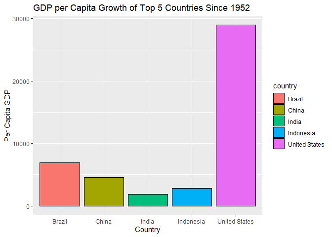

```r
library(tidyverse)
```


```r
#install.packages("gapminder")
library("gapminder")
```


```r
library(ggplot2)
```


**1. Use the function(s) of your choice to get an idea of the overall structure of the data frame, including its dimensions, column names, variable classes, etc. As part of this, determine how NAs are treated in the data.**  


```r
gapminder <- gapminder
```


```r
dim(gapminder)
```

```
## [1] 1704    6
```


```r
colnames(gapminder)
```

```
## [1] "country"   "continent" "year"      "lifeExp"   "pop"       "gdpPercap"
```


```r
str(gapminder)
```

```
## Classes 'tbl_df', 'tbl' and 'data.frame':	1704 obs. of  6 variables:
##  $ country  : Factor w/ 142 levels "Afghanistan",..: 1 1 1 1 1 1 1 1 1 1 ...
##  $ continent: Factor w/ 5 levels "Africa","Americas",..: 3 3 3 3 3 3 3 3 3 3 ...
##  $ year     : int  1952 1957 1962 1967 1972 1977 1982 1987 1992 1997 ...
##  $ lifeExp  : num  28.8 30.3 32 34 36.1 ...
##  $ pop      : int  8425333 9240934 10267083 11537966 13079460 14880372 12881816 13867957 16317921 22227415 ...
##  $ gdpPercap: num  779 821 853 836 740 ...
```


```r
summary(gapminder)
```

```
##         country        continent        year         lifeExp     
##  Afghanistan:  12   Africa  :624   Min.   :1952   Min.   :23.60  
##  Albania    :  12   Americas:300   1st Qu.:1966   1st Qu.:48.20  
##  Algeria    :  12   Asia    :396   Median :1980   Median :60.71  
##  Angola     :  12   Europe  :360   Mean   :1980   Mean   :59.47  
##  Argentina  :  12   Oceania : 24   3rd Qu.:1993   3rd Qu.:70.85  
##  Australia  :  12                  Max.   :2007   Max.   :82.60  
##  (Other)    :1632                                                
##       pop              gdpPercap       
##  Min.   :6.001e+04   Min.   :   241.2  
##  1st Qu.:2.794e+06   1st Qu.:  1202.1  
##  Median :7.024e+06   Median :  3531.8  
##  Mean   :2.960e+07   Mean   :  7215.3  
##  3rd Qu.:1.959e+07   3rd Qu.:  9325.5  
##  Max.   :1.319e+09   Max.   :113523.1  
## 
```


```r
gapminder %>%
  summarize(na_count = sum(is.na(gapminder)))
```

```
## # A tibble: 1 x 1
##   na_count
##      <int>
## 1        0
```


**2. Among the interesting variables in gapminder is life expectancy. How has global life expectancy changed between 1952 and 2007?**


```r
gapminder %>%
  group_by(year) %>%
  summarize(avg_life_exp = mean(lifeExp)) %>%
  ggplot(aes(x = year, y = avg_life_exp)) +
  geom_line()+
  geom_point() +
  xlab("Year")  +
  ylab("Average Life Expectancy") +
  labs(title = "Life Expectancy per Year")
```

<!-- -->


**3. How do the distributions of life expectancy compare for the years 1952 and 2007? _Challenge: Can you put both distributions on a single plot?_**


```r
life_1952 <- gapminder %>%
  select(lifeExp, year)%>%
  filter(year == 1952)

life_2007 <- gapminder %>%
  group_by(year) %>%
  select(lifeExp, year)%>%
  filter(year == 2007)
```


```r
life_2007
```

```
## # A tibble: 142 x 2
## # Groups:   year [1]
##    lifeExp  year
##      <dbl> <int>
##  1    43.8  2007
##  2    76.4  2007
##  3    72.3  2007
##  4    42.7  2007
##  5    75.3  2007
##  6    81.2  2007
##  7    79.8  2007
##  8    75.6  2007
##  9    64.1  2007
## 10    79.4  2007
## # ... with 132 more rows
```


```r
life_1952
```

```
## # A tibble: 142 x 2
##    lifeExp  year
##      <dbl> <int>
##  1    28.8  1952
##  2    55.2  1952
##  3    43.1  1952
##  4    30.0  1952
##  5    62.5  1952
##  6    69.1  1952
##  7    66.8  1952
##  8    50.9  1952
##  9    37.5  1952
## 10    68    1952
## # ... with 132 more rows
```


```r
life_exp_comparison <- ggplot(data = life_2007, aes(x= lifeExp))+
  geom_density(fill="steelblue", alpha  =0.6, color = "black") +
  # Change the fill colour to differentiate it
  geom_density(data= life_1952, fill="pink", alpha  =0.6, color = "black") +
  labs(title = "Distribution of Life Expectancy in 1957 and 2007")+
  labs(y="Density")+
  labs(x="Life Expectancy")

life_exp_comparison
```

<!-- -->

```r
#Results show that distribution of life expectancy between 1952 and 2007 has shifted considerably to the right (higher life expectancy)
```


**4. Your answer above doesn't tell the whole story since life expectancy varies by region. Make a summary that shows the min, mean, and max life expectancy by continent for all years represented in the data.**


```r
continent_lifeExp <- gapminder %>% 
  group_by(continent, year) %>% 
  summarize(min_lifeExp =min(lifeExp),
            max_lifeExp =max(lifeExp),
            mean_lifeExp =mean(lifeExp))

continent_lifeExp
```

```
## # A tibble: 60 x 5
## # Groups:   continent [5]
##    continent  year min_lifeExp max_lifeExp mean_lifeExp
##    <fct>     <int>       <dbl>       <dbl>        <dbl>
##  1 Africa     1952        30          52.7         39.1
##  2 Africa     1957        31.6        58.1         41.3
##  3 Africa     1962        32.8        60.2         43.3
##  4 Africa     1967        34.1        61.6         45.3
##  5 Africa     1972        35.4        64.3         47.5
##  6 Africa     1977        36.8        67.1         49.6
##  7 Africa     1982        38.4        69.9         51.6
##  8 Africa     1987        39.9        71.9         53.3
##  9 Africa     1992        23.6        73.6         53.6
## 10 Africa     1997        36.1        74.8         53.6
## # ... with 50 more rows
```


**5. How has life expectancy changed between 1952-2007 for each continent? Try using `geom_line()` for this, including all continents on the same  plot.**


```r
continent_lifeExp %>%
  ggplot(aes(x = year, y = mean_lifeExp, col = continent)) +
  geom_line()+
  geom_point() +
  xlab("Year")  +
  ylab("Average Life Expectancy") +
  labs(title = "Life Expectancy per Continent Through Time")
```

<!-- -->

**6. We are interested in the relationship between per capita GDP and life expectancy; i.e. does having more money help you live longer?**


```r
gapminder %>%
  ggplot(aes(x = lifeExp, y = gdpPercap)) +
  geom_point() +
  geom_smooth(method=lm, se=F) + 
  xlab("Life Expectancy")  +
  ylab("per capita GDP") +
  labs(title = "Life Expectancy per capita GDP") 
```

<!-- -->

```r
#There seems to be some sort of positive correlation between life expectancy and per capita GDP
```


**7. There is extreme disparity in per capita GDP. Rescale the x axis to make this easier to interpret. How would you characterize the relationship?**


```r
gapminder %>%
  filter(gdpPercap <= 50000) %>%
  ggplot(aes(x = lifeExp, y = gdpPercap)) +
  geom_point() +
  geom_smooth(method=lm) + 
  xlab("Life Expectancy")  +
  ylab("per capita GDP") +
  labs(title = "Life Expectancy per capita GDP") 
```

<!-- -->

**8. Which countries have had the largest population growth since 1952?**


```r
#population growth can be characterized as  the difference in population average size in 2007 vs average size in 1952

population_growth <- gapminder %>% 
  group_by(country, year) %>% 
  summarize(mean_pop =mean(pop)) %>%
  filter(year == 1952 | year == 2007) %>%
  pivot_wider(names_from = year, values_from = mean_pop) %>%
  dplyr::rename(
    Year_1952 = '1952',
    Year_2007 = '2007'
  ) %>%
  mutate(pop_grow = Year_2007 - Year_1952) %>%
  arrange(desc(pop_grow))

population_growth
```

```
## # A tibble: 142 x 4
## # Groups:   country [142]
##    country       Year_1952  Year_2007  pop_grow
##    <fct>             <dbl>      <dbl>     <dbl>
##  1 China         556263527 1318683096 762419569
##  2 India         372000000 1110396331 738396331
##  3 United States 157553000  301139947 143586947
##  4 Indonesia      82052000  223547000 141495000
##  5 Brazil         56602560  190010647 133408087
##  6 Pakistan       41346560  169270617 127924057
##  7 Bangladesh     46886859  150448339 103561480
##  8 Nigeria        33119096  135031164 101912068
##  9 Mexico         30144317  108700891  78556574
## 10 Philippines    22438691   91077287  68638596
## # ... with 132 more rows
```


**9. Use your results from the question above to plot population growth for the top five countries since 1952.**


```r
head(population_growth, 5)
```

```
## # A tibble: 5 x 4
## # Groups:   country [142]
##   country       Year_1952  Year_2007  pop_grow
##   <fct>             <dbl>      <dbl>     <dbl>
## 1 China         556263527 1318683096 762419569
## 2 India         372000000 1110396331 738396331
## 3 United States 157553000  301139947 143586947
## 4 Indonesia      82052000  223547000 141495000
## 5 Brazil         56602560  190010647 133408087
```


```r
head(population_growth, 5) %>% 
  arrange(desc(pop_grow)) %>%
  ggplot(aes(x = country, y = pop_grow, fill = country)) +
  geom_bar(position = "dodge", color = "black", stat = "Identity") +
  xlab("Country")  +
  ylab("Population Growth") +
  labs(title = "Population Growth of Top 5 Countries Since 1952")
```

<!-- -->


**10. How does per capita GDP growth compare between these same five countries?**


```r
gdp_country <- gapminder %>%
  group_by(country, year) %>% 
  summarize(mean_gdp = mean(gdpPercap)) %>%
  filter(year == 1952 | year == 2007) %>%
  pivot_wider(names_from = year, values_from = mean_gdp) %>%
  dplyr::rename(
    gdp_1952 = '1952',
    gdp_2007 = '2007') %>%
  mutate(gdp_change = gdp_2007 - gdp_1952) %>%
  arrange(desc(gdp_change))

gdp_country
```

```
## # A tibble: 142 x 4
## # Groups:   country [142]
##    country          gdp_1952 gdp_2007 gdp_change
##    <fct>               <dbl>    <dbl>      <dbl>
##  1 Singapore           2315.   47143.     44828.
##  2 Norway             10095.   49357.     39262.
##  3 Hong Kong, China    3054.   39725.     36671.
##  4 Ireland             5210.   40676.     35466.
##  5 Austria             6137.   36126.     29989.
##  6 United States      13990.   42952.     28961.
##  7 Iceland             7268.   36181.     28913.
##  8 Japan               3217.   31656.     28439.
##  9 Netherlands         8942.   36798.     27856.
## 10 Taiwan              1207.   28718.     27511.
## # ... with 132 more rows
```


```r
gdp_country %>% 
  filter(country == "Brazil" | country == "China" | country == "India" | country == "Indonesia" | country == "United States") %>%
  ggplot(aes(x = country, y = gdp_change, fill = country)) +
  geom_bar(position = "dodge", color = "black", stat = "Identity") +
  xlab("Country")  +
  ylab("Per Capita GDP") +
  labs(title = "GDP per Capita Growth of Top 5 Countries Since 1952")
```

<!-- -->

```r
#Population growth and per capita gdp do not reflect the same way in these top 5 countries
```

